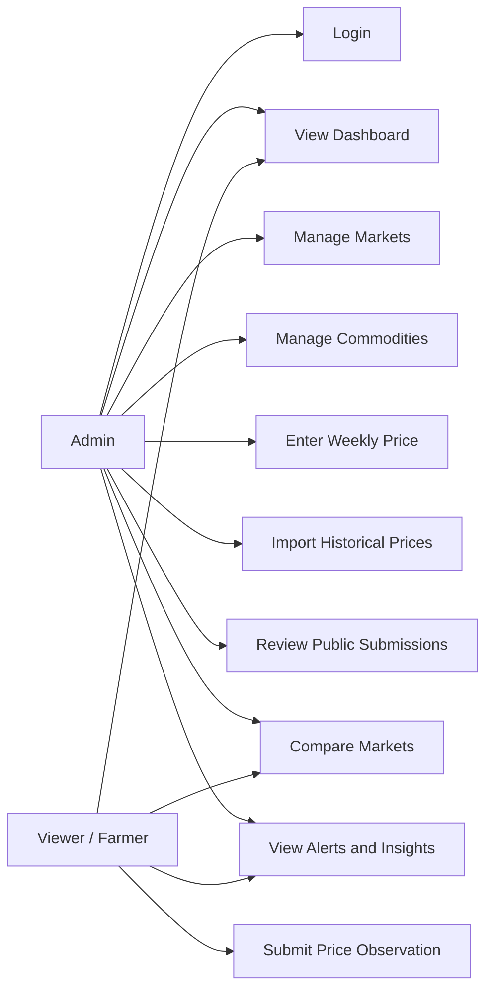

# Use Case Model

## Purpose
This document describes how each actor interacts with the system and clarifies the intended behavior of the finished implementation.

## Actors
### Admin
The authenticated manager responsible for system data quality, manual entry, CSV import, moderation, and operational oversight.

### Viewer/Farmer
The public user who consumes charts, comparisons, alerts, and approved market information, and may submit price observations for review.

## Use Case Summary
- Admin Login
- View Dashboard
- Manage Markets
- Manage Commodities
- Enter Weekly Price
- Import Historical Prices
- Submit Price Observation
- Review Public Submissions
- Compare Markets
- View Alerts and Insights

## Use Case Details

### UC-01 Admin Login
- Primary actor: Admin
- Goal: Access protected data-management features
- Precondition: Admin account exists
- Postcondition: Authenticated session established
- Primary flow:
  1. Admin submits valid login credentials.
  2. System validates credentials.
  3. System returns an authenticated session token.
  4. Admin gains access to protected routes.
- Alternative flow:
  - Invalid credentials are rejected with an error message.

### UC-02 View Dashboard
- Primary actor: Admin or Viewer/Farmer
- Goal: Review prices, trends, and comparisons
- Precondition: Relevant approved price data exists
- Postcondition: User sees summaries and charts
- Primary flow:
  1. User opens a dashboard page.
  2. User selects filters if needed.
  3. System retrieves summary and chart data.
  4. System displays trends, comparisons, and explanations.
- Alternative flow:
  - If no matching records exist, the system shows a no-data state rather than an empty chart.

### UC-03 Manage Markets
- Primary actor: Admin
- Goal: Review and maintain market records
- Precondition: Admin is authenticated
- Postcondition: Approved market reference data remains accurate

### UC-04 Manage Commodities
- Primary actor: Admin
- Goal: Review and maintain commodity records
- Precondition: Admin is authenticated
- Postcondition: Commodity reference data remains accurate

### UC-05 Enter Weekly Price
- Primary actor: Admin
- Goal: Store a weekly price record
- Precondition: Admin is authenticated and market and commodity exist
- Postcondition: Price record becomes available for analysis
- Alternative flow:
  - Invalid values or duplicates are rejected with a clear message.

### UC-06 Import Historical Prices
- Primary actor: Admin
- Goal: Upload many price records from CSV
- Precondition: Admin is authenticated and CSV follows approved structure
- Postcondition: Valid rows are imported and invalid rows are reported
- Alternative flow:
  - If the file structure is invalid, import is rejected before persistence.

### UC-07 Submit Price Observation
- Primary actor: Viewer/Farmer
- Goal: Submit a proposed price update without direct database access
- Precondition: Market and commodity are within approved scope
- Postcondition: Submission enters the moderation queue
- Primary flow:
  1. User opens the public upload page.
  2. User chooses CSV upload or guided form entry.
  3. User enters market, commodity, date, unit, and price values.
  4. System validates the submission shape.
  5. System stores the submission as pending review.
- Alternative flow:
  - Invalid rows are rejected with clear validation feedback.

### UC-08 Review Public Submissions
- Primary actor: Admin
- Goal: Accept or reject community-submitted price data before publication
- Precondition: Admin is authenticated and pending submissions exist
- Postcondition: Approved submissions become official records, rejected ones remain excluded

### UC-09 Compare Markets
- Primary actor: Admin or Viewer/Farmer
- Goal: Compare the same commodity across markets
- Precondition: Comparable data exists for the requested period
- Postcondition: User sees ranked prices, spread, and state average

### UC-10 View Alerts and Insights
- Primary actor: Admin or Viewer/Farmer
- Goal: Understand rule-based findings
- Precondition: Enough data exists for rules to evaluate
- Postcondition: User receives plain-language explanation and supporting values

## Use Case Diagram

## Personal Actions Required
- If your report requires a screenshot-based use case diagram, redraw this Mermaid diagram in your preferred tool and record that step in `docs/references/diagram-redraw-reference.md`.
