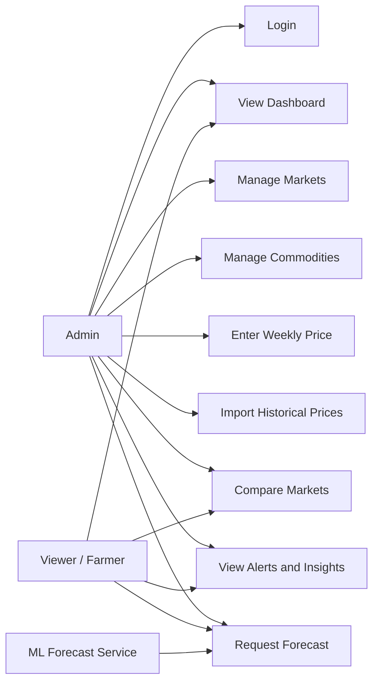

# Use Case Model

## Purpose
This document describes how each actor interacts with the system and clarifies the intended behavior before implementation.

## Actors
### Admin
The authenticated manager responsible for system data quality, manual entry, CSV import, and operational oversight.

### Viewer/Farmer
The read-only user who consumes charts, comparisons, alerts, and forecast summaries.

### ML Forecast Service
An external supporting system component used only when forecast generation is requested and sufficient historical data exists.

## Use Case Summary
- Admin Login
- View Dashboard
- Manage Markets
- Manage Commodities
- Enter Weekly Price
- Import Historical Prices
- Compare Markets
- View Alerts and Insights
- Request Forecast

## Use Case Details

### UC-01 Admin Login
- Primary actor: Admin
- Goal: Access protected data-management features
- Precondition: Admin account exists
- Postcondition: Authenticated session established
- Primary flow:
  1. Admin submits valid login credentials.
  2. System validates credentials.
  3. System returns an authenticated session token.
  4. Admin gains access to protected routes.
- Alternative flow:
  - Invalid credentials are rejected with an error message.

### UC-02 View Dashboard
- Primary actor: Admin or Viewer/Farmer
- Goal: Review prices, trends, and comparisons
- Precondition: Relevant price data exists
- Postcondition: User sees summaries and charts
- Primary flow:
  1. User opens a dashboard page.
  2. User selects filters if needed.
  3. System retrieves summary and chart data.
  4. System displays trends, comparisons, and explanations.
- Alternative flow:
  - If no matching records exist, the system shows a no-data state rather than an empty chart.

### UC-03 Manage Markets
- Primary actor: Admin
- Goal: Review and maintain market records
- Precondition: Admin is authenticated
- Postcondition: Approved market reference data remains accurate
- Primary flow:
  1. Admin opens market management.
  2. Admin views or updates market metadata.
  3. System validates uniqueness and scope.
  4. System saves valid changes.

### UC-04 Manage Commodities
- Primary actor: Admin
- Goal: Review and maintain commodity records
- Precondition: Admin is authenticated
- Postcondition: Commodity reference data remains accurate
- Primary flow:
  1. Admin opens commodity management.
  2. Admin views or updates commodity metadata.
  3. System validates uniqueness and scope.
  4. System saves valid changes.

### UC-05 Enter Weekly Price
- Primary actor: Admin
- Goal: Store a weekly price record
- Precondition: Admin is authenticated and market and commodity exist
- Postcondition: Price record becomes available for analysis
- Primary flow:
  1. Admin opens the entry form.
  2. Admin chooses market, commodity, date, unit, and price.
  3. System validates the values.
  4. System stores the record.
- Alternative flow:
  - Invalid values or duplicates are rejected with a clear message.

### UC-06 Import Historical Prices
- Primary actor: Admin
- Goal: Upload many price records from CSV
- Precondition: Admin is authenticated and CSV follows approved structure
- Postcondition: Valid rows are imported and invalid rows are reported
- Primary flow:
  1. Admin uploads a CSV file.
  2. System validates structure and rows.
  3. System imports valid rows.
  4. System returns an import summary.
- Alternative flow:
  - If the file structure is invalid, import is rejected before persistence.

### UC-07 Compare Markets
- Primary actor: Admin or Viewer/Farmer
- Goal: Compare the same commodity across markets
- Precondition: Comparable data exists for the requested period
- Postcondition: User sees ranked prices, spread, and state average

### UC-08 View Alerts and Insights
- Primary actor: Admin or Viewer/Farmer
- Goal: Understand rule-based findings
- Precondition: Enough data exists for rules to evaluate
- Postcondition: User receives plain-language explanation and supporting values

### UC-09 Request Forecast
- Primary actor: Admin or Viewer/Farmer
- Supporting actor: ML Forecast Service
- Goal: View short-term estimated future prices
- Precondition: Enough historical records exist for forecast generation
- Postcondition: Forecast is presented with explanatory context
- Alternative flow:
  - If there is insufficient data, the system declines the forecast request and explains why.

## Use Case Diagram

## Personal Actions Required
- If your report requires a screenshot-based use case diagram, redraw this Mermaid diagram in your preferred tool and record that step in `docs/references/diagram-redraw-reference.md`.
