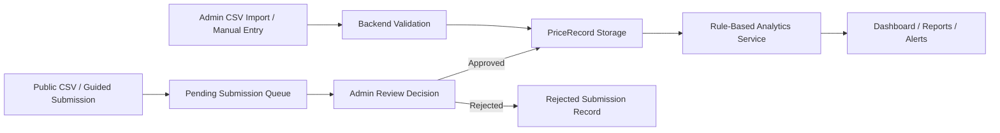

# Data Flow and Analysis Rules

## Purpose
This document explains how data moves through BAPI and how the analytical rules are applied.

## High-Level Flow

## Core Data Rules
1. Only approved and validated price records enter the official analytics layer.
2. Historical records remain the source of truth for comparisons and summaries.
3. Public submissions do not affect live analytics until they are approved by an admin.
4. Trends compare consecutive valid observations for the same market and commodity.
5. Alerts are generated from threshold-based changes in approved records.
6. State averages are calculated from the available approved market values.

## Trend Rule
- Compare the latest valid price against the previous valid price for the same series.
- Classify the result as:
  - upward
  - downward
  - stable
- Placeholder default: between `-3%` and `+3%` is stable.

## Alert Rule
- Generate an alert when the week-over-week change crosses the configured threshold.
- Recommended initial threshold placeholder: `10%`

## Seasonality Rule
- Summaries should only be generated when enough historical records exist.
- If records are insufficient, the system should say so instead of inventing a seasonal claim.

## Moderation Guardrails
- Public submission is optional input, not automatic publication.
- Only approved submissions become official price records.
- Rejected submissions remain excluded from analytics.
- Admin review decisions should remain traceable for later explanation.

## Personal Actions Required
- Update the threshold placeholders if supervisor feedback or dataset review requires different values.
