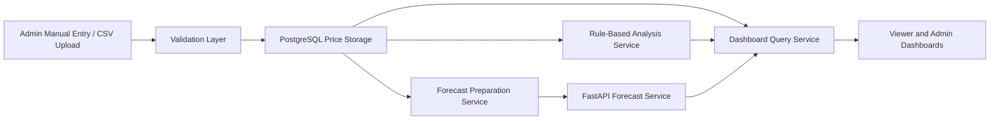

# Data Flow and Analysis Rules

## Purpose
This document defines how price data moves through the system and how deterministic analytical outputs are generated before ML is introduced.

## Data Flow Diagram

## End-to-End Flow
1. An admin enters or uploads price data.
2. The backend validates structure and values.
3. Valid records are stored in PostgreSQL.
4. Analytical services read stored records and compute summaries.
5. Dashboard responses combine numerical values and explanation text.
6. Forecasting is requested only when sufficient historical records exist.

## Rule-Based Analysis Philosophy
The project must remain useful without machine learning. Therefore, the first analytical layer is deterministic, transparent, and traceable back to actual stored values.

## Initial Deterministic Rules

### Trend Detection Rule
- Compare the current period value to the immediately previous comparable period.
- If the percentage increase is above the stable range, classify as `upward`.
- If the percentage decrease is below the stable range, classify as `downward`.
- Otherwise, classify as `stable`.

### Recommended Initial Stable Range
- Placeholder default: between `-3%` and `+3%`
- This is a working project default and may be refined later after seed-data review.

### Alert Rule
- Trigger an alert when the week-over-week change exceeds a configured threshold.
- Recommended initial threshold placeholder: `10%`
- Alert output must include old value, new value, percentage change, and interpretation.

### Market Comparison Rule
- For a selected commodity and period, compare the prices across all four markets.
- Return:
  - highest market
  - lowest market
  - absolute spread
  - state average
  - ranked order of markets

### State Average Rule
- Compute the arithmetic average of available prices across the selected four markets for the same commodity and period.
- If one or more markets have missing values, the system must indicate that the average is based only on available records.

### Seasonality Rule
- Group historical prices by month or quarter.
- Identify months or periods that repeatedly show relatively higher or lower averages.
- If historical depth is too small, return “insufficient data” rather than a false seasonal claim.

### Missing Data Rule
- If a requested trend or seasonal summary lacks enough records, the system must return a data-availability explanation.

## Explainability Format
Every analytical output must include:
- market and commodity context
- date or period compared
- raw values used
- derived difference or percentage
- plain-language conclusion

## Example Explanation
`Maize price in Makurdi increased from 32,000 NGN to 36,500 NGN between 2026-03-01 and 2026-03-08, representing a 14.06% increase, so the trend is classified as upward and an alert is triggered because the change exceeds the configured threshold.`

## Forecast Guardrails
- Forecasting is optional, not foundational.
- Forecasting should only run when historical records are sufficient.
- Forecast results must be labeled as estimates.
- Forecast values must remain visually and semantically separate from observed data.

## Personal Actions Required
- If you later refine thresholds after examining real sample data, update this document and reference the decision in `docs/meetings/supervisor-log.md`.
- If your final report requires chart screenshots for these rules, capture them later and list them in `docs/references/presentation-and-screenshot-reference.md`.
