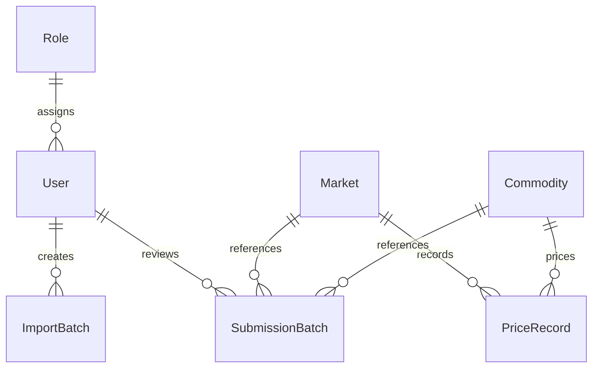

# Entity Relationship Design

## Purpose
This document defines the core data model needed to support authentication, price capture, submission moderation, import traceability, and explainable analysis.

## Core Entities

### Role
Stores authorization roles such as admin.

### User
Stores authenticated admin users and their role association.

### Market
Stores the four approved markets.

### Commodity
Stores the eight approved commodities.

### PriceRecord
Stores approved historical and weekly price observations.

### ImportBatch
Stores metadata for admin CSV imports.

### SubmissionBatch
Stores public contribution batches that await approval or rejection.

### AnalysisSnapshot
Stores cached or summarized analysis outputs when needed.

### Alert
Stores generated alert records and their explanations.

## Relationships
- One role can be assigned to many users.
- One market can appear in many price records, alerts, snapshots, imports, and submissions.
- One commodity can appear in many price records, alerts, snapshots, imports, and submissions.
- One submission batch can contain many proposed price rows.

## Simplified ERD

## Integrity Notes
- Historical records should not be deleted casually because they drive comparisons and analytics.
- Duplicate official price records for the same market, commodity, date, and unit should be prevented.
- Submission review data should remain available for audit and explanation.

## Personal Actions Required
- If your report needs a polished visual ERD, redraw this later and note that in `docs/references/diagram-redraw-reference.md`.
