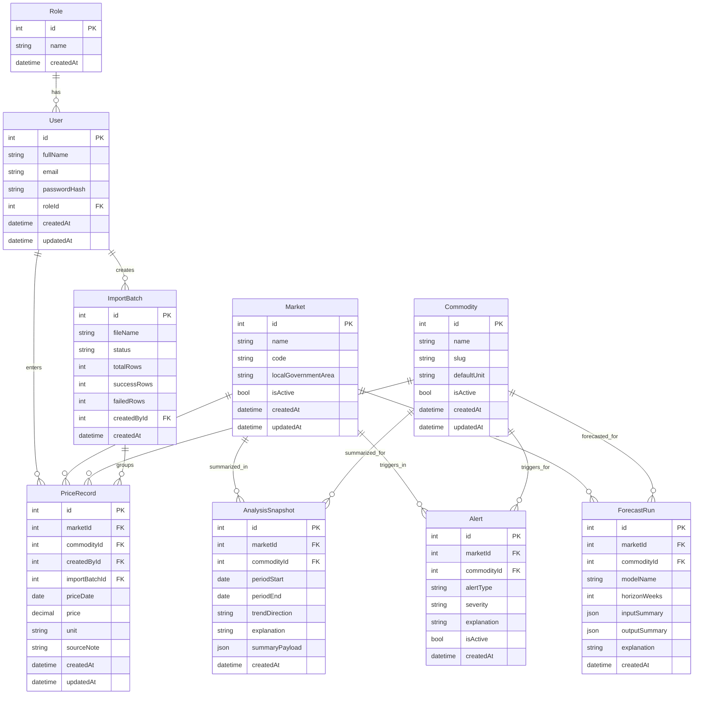

# Entity Relationship Design

## Purpose
This document defines the core data model needed to support authentication, price capture, import traceability, explainable analysis, and forecasting metadata.

## Modeling Principles
- Keep the schema normalized enough for correctness and maintainability.
- Preserve historical market-price records rather than overwriting them.
- Keep analytical outputs reproducible when needed.
- Avoid unnecessary entities outside the approved scope.

## Core Entities and Purpose

### Role
Defines user access level. Initial values are expected to include `ADMIN` and `VIEWER`.

### User
Stores login identity, account metadata, and role association.

### Market
Stores the approved market reference data for Makurdi, Gboko, Zaki Biam, and Otukpo.

### Commodity
Stores the approved commodity reference data for the eight selected commodities.

### ImportBatch
Stores metadata for CSV uploads, including row totals and processing outcome.

### PriceRecord
The central transactional entity for historical and weekly prices.

### AnalysisSnapshot
Stores generated rule-based summary outputs if the system chooses to persist them for traceability.

### Alert
Stores alert events and explanation text derived from analytical rules.

### ForecastRun
Stores metadata about forecast requests, model usage, and output summaries.

## Relationship Logic
- One role can belong to many users.
- One user can create many import batches.
- One user can enter many price records.
- One market can appear in many price records, alerts, snapshots, and forecasts.
- One commodity can appear in many price records, alerts, snapshots, and forecasts.
- One import batch can group many price records.

## ER Diagram

## Integrity Rules
- A price record must reference exactly one market and one commodity.
- A price record should be unique for the same market, commodity, date, and unit unless future versioning is deliberately introduced.
- Historical records should not be deleted casually because they drive comparisons and forecasts.
- Markets and commodities must remain inside the approved scope.

## Normalization Notes
- Market and commodity metadata are separated from transactional price records to avoid duplication.
- ImportBatch separates operational import tracking from the actual price rows.
- Analytical entities are separated from raw observations so historical records remain clean.

## Data Model Assumptions
- A viewer account may exist later for role completeness, but only admin authentication is essential initially.
- ForecastRun stores summary artifacts, not necessarily every generated point unless required later.
- AnalysisSnapshot is optional for persistence but helpful for reproducibility.

## Personal Actions Required
- If your final report requires a redrawn ERD image, recreate this diagram in a diagram tool and record it in `docs/references/diagram-redraw-reference.md`.
