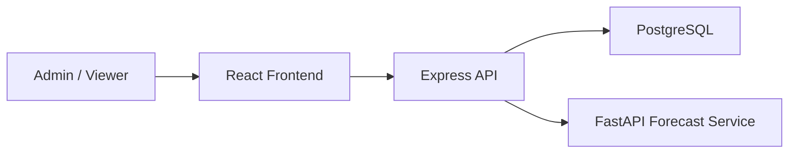

# System Architecture

## Purpose
This document defines the major subsystems of BAPI, how they interact, and why the chosen separation supports maintainability and academic explainability.

## Architectural Style
BAPI follows a modular service-based web architecture within a monorepo:
- web frontend for presentation and interaction
- backend API for validation, business logic, and persistence access
- PostgreSQL database for core data storage
- separate ML microservice for optional forecasting

## High-Level Components

### Frontend (`apps/web`)
Responsibilities:
- render dashboards and charts
- support filtering by commodity, market, and date range
- provide admin forms for data entry and CSV import
- present explanations from backend analytics
- enforce the project theme and visual identity

### Backend API (`apps/api`)
Responsibilities:
- authenticate admins
- validate requests using structured schemas
- manage reference data and price records
- compute rule-based analytics
- expose report-friendly and chart-friendly responses
- call the ML service only when forecast requests are valid

### Database (PostgreSQL)
Responsibilities:
- persist users, roles, markets, commodities, price records, import batches, alerts, snapshots, and forecast metadata
- preserve historical records as the source of truth

### ML Microservice (`apps/ml`)
Responsibilities:
- receive forecasting requests with prepared historical series
- generate short-term forecast output
- return forecast summaries without owning the rest of the system

## Request Lifecycle Example
1. A user opens a dashboard in the frontend.
2. The frontend calls the backend API with filters.
3. The backend validates the request.
4. The backend retrieves relevant price records from PostgreSQL.
5. The backend computes summaries, comparisons, and analytical explanations.
6. The backend returns structured data to the frontend.
7. The frontend renders charts and explanatory text.

If a forecast is requested:
1. The backend checks whether enough data exists.
2. The backend prepares the series payload.
3. The backend calls the ML microservice.
4. The microservice returns forecast output and context.
5. The backend relays forecast information to the frontend alongside clear labeling.

## Backend Layering
- routes: endpoint grouping and request routing
- controllers: request-response orchestration
- services: business and analytical logic
- repositories: data-access abstraction around Prisma
- validators: Zod schemas for request safety
- utils: shared helpers for dates, formatting, and calculations

## Frontend Layering
- pages: route-level screens
- features: domain modules such as auth, prices, analytics
- components: shared visual building blocks
- hooks: query and interaction helpers
- services: API client utilities
- theme: color tokens, gradients, and grid-background utilities

## High-Level Interaction Diagram

## Explainability Rationale
- Core monitoring and analysis are performed without ML.
- Rule-based outputs are deterministic and easy to explain.
- Forecasting is optional and explicitly labeled as estimation.
- Historical values remain distinguishable from predicted values.

## Deployment Context
The intended local deployment model is Docker Compose so that frontend, backend, database, and ML service can be started consistently for testing and defense demonstrations.

## Personal Actions Required
- If your final report requires polished image diagrams instead of Mermaid, recreate the diagram later and record that in `docs/references/diagram-redraw-reference.md`.
