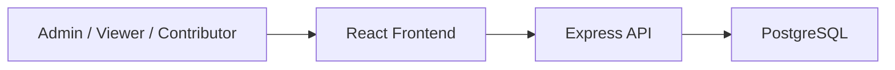

# System Architecture

## Purpose
This document defines the major subsystems of BAPI, how they interact, and why the chosen separation supports maintainability and academic explainability.

## Architectural Style
BAPI follows a modular web architecture within a single repository:
- frontend for presentation and interaction
- backend API for validation, business logic, moderation, and persistence access
- PostgreSQL database for core data storage

## High-Level Components

### Frontend (`frontend`)
Responsibilities:
- render dashboards and charts
- support filtering by commodity, market, and date range
- provide public contribution forms and admin management pages
- present explanations from backend analytics
- enforce the project theme and visual identity

### Backend API (`backend`)
Responsibilities:
- authenticate admins
- validate requests using structured schemas
- manage reference data and price records
- moderate public submissions before publication
- compute rule-based analytics
- expose report-friendly and chart-friendly responses

### Database (PostgreSQL)
Responsibilities:
- persist users, roles, markets, commodities, price records, import batches, alerts, snapshots, and submission moderation records
- preserve approved historical records as the source of truth

## Request Lifecycle Example
1. A user opens a dashboard in the frontend.
2. The frontend calls the backend API with filters.
3. The backend validates the request.
4. The backend retrieves relevant approved price records from PostgreSQL.
5. The backend computes summaries, comparisons, and analytical explanations.
6. The backend returns structured data to the frontend.
7. The frontend renders charts and explanatory text.

If a public submission is made:
1. The frontend sends the proposed rows to the backend.
2. The backend validates the submission shape and scope.
3. The backend stores the submission in the pending review queue.
4. An admin reviews the batch.
5. Only approved rows are converted into official price records.

## Backend Layering
- routes: endpoint grouping and request routing
- controllers: request-response orchestration
- services: business and analytical logic
- validators: Zod schemas for request safety
- utils: shared helpers for dates, formatting, and calculations

## Frontend Layering
- pages: route-level screens
- components: shared visual building blocks
- hooks: query and interaction helpers
- services: API client utilities
- data: local UI support data where needed
- theme: color tokens, gradients, and grid-background utilities

## High-Level Interaction Diagram

## Explainability Rationale
- Core monitoring and analysis are performed without machine learning.
- Rule-based outputs are deterministic and easy to explain.
- Public submissions are separated from approved official records.
- Historical values remain the authoritative source for analytics.

## Deployment Context
The intended local deployment model is Docker Compose so that frontend, backend, and database can be started consistently for testing and defense demonstrations.

## Personal Actions Required
- If your final report requires polished image diagrams instead of Mermaid, recreate the diagram later and record that in `docs/references/diagram-redraw-reference.md`.
